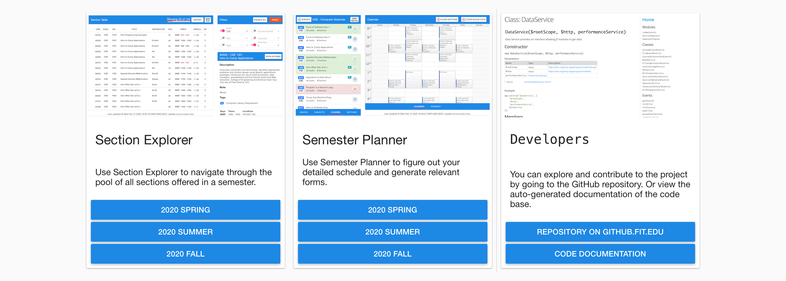
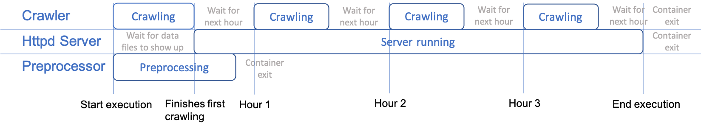
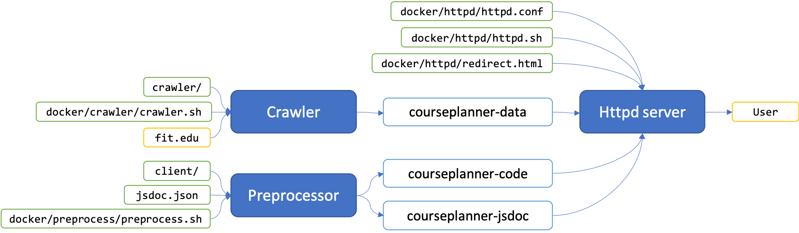
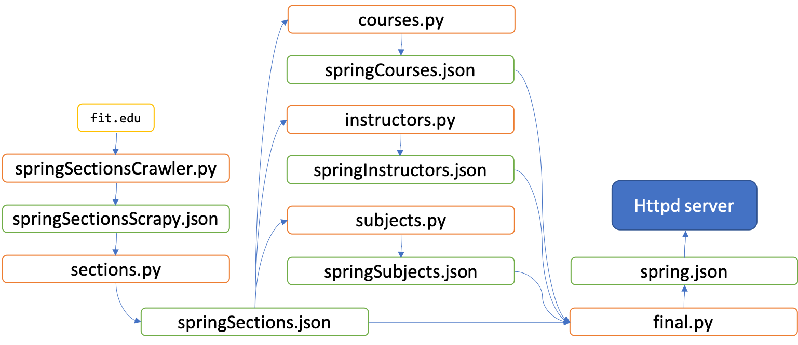
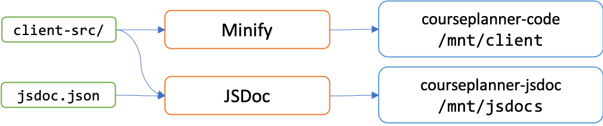
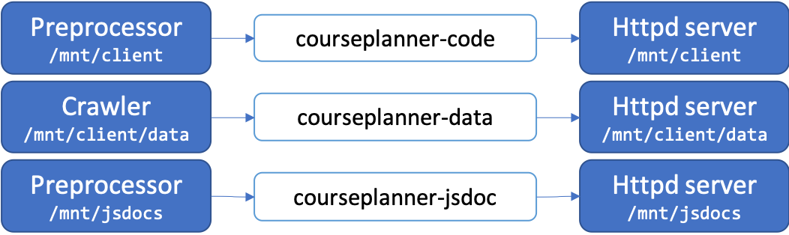

# Florida Tech Course Planner Bundle
Improving Florida Tech students' and faculties' experience in planning future courses since 2020 spring.



## Install Softwares
This section guides you through installing softwares necessary for developing this project.

### Visual Studio Code
We recommend using Visual Studio Code as the primary editor for this project and we will guide you through setup process.
It is perfectly fine to use other editors, but we would not walk you through the setup process.

#### Install Visual Studio Code
Goto [https://code.visualstudio.com](https://code.visualstudio.com) and follow the official installation process.

#### Install Relevant Extensions
We recommend you to install the following extensions for optimal experiences in development.
To install them, copy and search their name in your VS Code. Some extensions are also good for other projects.

* Bookmarks
* Bracket Pair Colorizer 2
* Code Spell Checker
* Docker
* GitLens — Git supercharged
* javascript console utils
* jshint
* Live Server
* Partial Diff
* Python
* vscode-icons

Make sure the extensions are enabled for the project.
Otherwise they are only installed on your computer but will never function.

### npm
Some software packages used by this project are installed using npm.

#### Install npm
Goto [https://www.npmjs.com/get-npm](https://www.npmjs.com/get-npm) and follow the official installation process.

#### Install npm Packages
Install the following npm packages that are necessary to develop and run the project.
Use the command ```npm install -g <package name>``` to install globally. You may need ```sudo``` to install.

* jsdoc
* jshint
* minify

### Python
Python is used to code the crawler.
The crawler is responsible to capture, analyze, and organize the data needed by the user interface.
We use Python 3 for the project.

#### Install Python 3
Goto [https://www.python.org/downloads/](https://www.python.org/downloads/) and follow the official installation process.

#### Install Python 3 packages
Install the following npm packages that are necessary to develop and run the project.
Use the command ```pip install <package name>``` to install globally.
You may need ```sudo``` to install.
On some systems, Python 2 and Python 3 are both installed.
If that is the case and Python 3 cannot find packages after the ```pip``` command, try install again using ```pip3 install <package name>```.

* Scrapy

### Docker
This project relies on Docker for deployment.
Docker provides a balance between deploy efficiency and safety.

#### Install Docker
Goto [https://www.docker.com/products/docker-desktop](https://www.docker.com/products/docker-desktop) and follow the official installation process.

### Git
You are probably already using Git if you are reading this text.
However, we want to make sure that you installed it.

#### Install Git
Goto [https://git-scm.com/downloads](https://git-scm.com/downloads)  and follow the official installation process.

## Start Developing
This section shows you things we do when developing.

### Local Live Preview Using [Live Server](https://marketplace.visualstudio.com/items?itemName=ritwickdey.LiveServer)
You can spin up a local live server to view changes as you type.
The Live Server extension for VS Code is used for this purpose.
To start previewing, follow the steps:

1. Goto ```./client/html``` folder.
    There should be a side bar showing the file tree of this project.
1. Right click ```index.html```, a menu should pop up.
1. Click "Open with Live Server" and wait a few seconds for the server to startup.
1. Your default browser window will open and you are automatically sent to <http://127.0.0.1:5500/client/html/index.html> for the preview.
1. Now make changes to ```index.html```.
    For example, you can change the HTML title to ```<title>Oh yea it's working</title>```.
    Save the file and Live Server automatically refreshes the page for you.
    The change is visible immediately.

In most cases, the auto reload feature of Live Server is really helpful.
But it could cause your browser to reload too frequently, because it reloads every time a file was changed in the project.
Watch out for this pitfall when you are on battery and when you hear the fan starts to roar.
One simple way to avoid this pitfall is to close the browser page when you do not have to see the changes.
Once the page is closed, Live Server will not open up a new page and will not try to reload.

### Generate Code Documentation Using [JSDoc](https://jsdoc.app)
JSDoc is a tool for easily generating documentation for a JavaScript project.
You should have the npm package ```jsdoc``` installed and is ready to use.

1. Open new terminal (command line) interface in VS Code.
    There is an integrated terminal interface in VS Code so that you do not have to open another window.
1. Execute the command: ```jsdoc --configure jsdoc.json --private```.
    If it was successful, there should be no output from the command.
1. You should see a ```jsdocs``` folder being created in project root folder.
    The documentation is located in this folder.
1. Find ```jsdocs/index.html``` and open it with Live Server.
    You should be able to read the documentation now.

Notice ```jsdocs``` folder is ignored by Git.
This is intentionally done to avoid having unnecessary files in the project.
When deploying, documentation files are generated in one of the preprocessing steps.
Because documentation files are located inside of the project, Live Server will reload if any of the documentation files changes even if they are ignored by Git.
To make your life easier, you can configure a VS Code tasks configuration file.
Create ```.vscode/tasks.json``` and include the following content:
```json
{
    "version": "2.0.0",
    "tasks": [
        {
            "label": "Run JSDoc",
            "type": "shell",
            "command": "jsdoc",
            "args": ["--configure", "jsdoc.json", "--private"],
            "problemMatcher": []
        },
        {
            "label": "Clear JSDoc",
            "type": "shell",
            "command": "rm",
            "args": ["-r", "jsdocs/*"],
            "problemMatcher": []
        }
    ]
}
```
This ```.vscode/tasks.json``` creates automated tasks for VS Code and you can run tasks with keyboard shortcuts.
Refer to [https://code.visualstudio.com/docs/editor/tasks](https://code.visualstudio.com/docs/editor/tasks) to learn how to utilize tasks in VS Code.

### Actively Checking Your Spelling Using [Code Spell Checker](https://marketplace.visualstudio.com/items?itemName=streetsidesoftware.code-spell-checker)
We make mistakes when spelling, and there is a way to reduce it.
This VS Code extension checks and warn you about potentially incorrect spelling as you type.
Although it works 99% of the time, it does not cover some specific words we use in this project and these words will be marked as mistyped.
To silence the warning, you can create ```.vscode/settings.json``` and put in the content:
```json
{
    "cSpell.words": [
        "Crns",
        "Cybersecurity",
        "angularjs",
        "busybox",
        "courseplanner",
        "datetime",
        "daypilot",
        "deserialized",
        "entrypoint",
        "httpd",
        "jsdocs",
        "scrapy",
        "sprintf",
        "subheader",
        "tbody",
        "vsprintf"
    ]
}
```
These are the words that are marked as mistyped but are not.
If you see a word being mistyped, click on the bulb icon at the start of the line and choose ```Add <word> to folder directory```.
Refer to [https://code.visualstudio.com/docs/getstarted/settings](https://code.visualstudio.com/docs/getstarted/settings) to learn how settings file works in VS Code.

### Test Deployment By Deploying Locally With [Docker](https://www.docker.com)
There are always uncertainties involved in actually deploying the project, and the risk can be reduced by deploying locally and verify if it works.
This project deploys using Docker.
The following steps assumes you already have Docker installed, have access to ```docker``` command, and have the permission to execute ```docker``` command.

1. Goto ```./docker```.
    You must be in this folder to execute any script.
1. Execute ```./start.sh```.
    The script will build images, create volumes, and start the containers.
    It may take a while to build images.
    The script calls ```./stop.sh``` and there will be errors because it tries to delete containers and volumes but there is none.
    You can ignore these errors.
1. When the script finishes, there will be 3 containers being created.
    Container 1 includes the crawler, it immediately starts to craw the university website.
    Container 2 includes the preprocessor, it generates JSDoc and minifies server files.
    Container 3 includes the httpd server, it waits until data file is generated by container 1.
    The output of ```docker ps -a``` should look like the following:
    ```text
    CONTAINER ID        IMAGE                      COMMAND                  CREATED             STATUS              PORTS                NAMES
    e4944135dd9c        busybox                    "sh /mnt/httpd.sh"       12 seconds ago      Up 9 seconds        0.0.0.0:80->80/tcp   courseplanner-httpd
    cdc4db9689f7        courseplanner-preprocess   "docker-entrypoint.s…"   13 seconds ago      Up 12 seconds                            courseplanner-preprocess
    ee6283b52a9c        courseplanner-crawler      "bash /mnt/crawler.sh"   15 seconds ago      Up 13 seconds                            courseplanner-crawler
    ```
1. It needs a moment for the preprocessing steps to complete and you will see container 1 and 2 using significant amount of CPU.
    When it finishes, container 1 will have a ```cron``` process running and container 2 will exit with code (0).
    The output of ```docker ps -a``` should look like the following:
    ```text
    CONTAINER ID        IMAGE                      COMMAND                  CREATED              STATUS                     PORTS                NAMES
    e4944135dd9c        busybox                    "sh /mnt/httpd.sh"       About a minute ago   Up About a minute          0.0.0.0:80->80/tcp   courseplanner-httpd
    cdc4db9689f7        courseplanner-preprocess   "docker-entrypoint.s…"   About a minute ago   Exited (0) 2 seconds ago                        courseplanner-preprocess
    ee6283b52a9c        courseplanner-crawler      "bash /mnt/crawler.sh"   About a minute ago   Up About a minute                               courseplanner-crawler
    ```
1. Goto [http://127.0.0.1:80](http://127.0.0.1:80) to see the deployed version.
1. Execute ```./stop.sh``` to stop the containers and delete volumes.
    To rapidly rerun the deployment, you can directly execute ```./start.sh``` as it stops deployment before re-deploying.

## Project Structure
This section shows you the structure of the project.

### Backend (Server Side)
This section shows you the structure of the backend.

#### Backend Components
The backend contains 3 major components:

1. Crawler, implemented using Scrapy with Python 3.
1. Preprocessor, implemented using JSDoc and Minify.
1. Httpd server, implemented using Busybox.

Each of the components runs in their own Docker container.

#### Backend Execution Timeline


#### Backend Information flow


#### Related Files
```text
├── crawler                             Crawler scripts.
│   ├── crawl.sh                        Main crawler script. Responsible for setting up environment variables, do crawling, copy data files to client folder, and clean-up.
│   └── script                          Crawler Python scripts.
│       ├── courses.py                  Summarize list of courses.
│       ├── fallSectionsCrawler.py      Get raw data of fall semester.
│       ├── final.py                    Combine many lists into 1 JSON file.
│       ├── instructors.py              Summarize list of instructors.
│       ├── Makefile                    Driver for the crawler. Was used for handling script dependencies.
│       ├── scheduleMetaCrawler.py      Get year number for schedules.
│       ├── sections.py                 Summarize list of sections.
│       ├── springSectionsCrawler.py    Get raw data of spring semester.
│       ├── subjects.py                 Summarize list of subjects.
│       └── summerSectionsCrawler.py    Get raw data of fall semester.
└── docker                              Docker-related files.
    ├── crawler                         Crawler container files.
    │   ├── crawler.sh                  Setup crontab to run crawler in fixed schedule.
    │   └── Dockerfile                  Install files for the image.
    ├── httpd                           Httpd server container files.
    │   ├── httpd.conf                  Configuration for Httpd server.
    │   ├── httpd.sh                    Wait for data files to appear, then start the Httpd server.
    │   └── redirect.html               Redirect user to the real index.html.
    ├── preprocess                      Preprocessor container files.
    │   ├── Dockerfile                  Install files for the image.
    │   └── preprocess.sh               Generate JSDoc and minify files.
    ├── start.sh                        Call stop.sh, build images, create volumes, and start containers.
    └── stop.sh                         Stop containers, remove containers, and remove volumes.
```

#### Crawler
The crawler's code mostly resides in ```./crawler```.

##### Powered by ```Makefile```
The reason to use a ```Makefile``` is due to the fact that it requires multiple steps with prerequisites to generate a data file.
GNU Make, while was intended for different purposes, incidentally offers a simple way to specify goals and their prerequisites.
It automatically determines the order of commands based on the prerequisites, so we never manually determined the order, which minifies human error.
However, the advantage of using GNU Make was no longer significant after the project supports multiple semesters.
But the ```Makefile``` is still being used till today for historical reasons.

##### How Data was Processed
Here we use the spring semester as an example.
Scripts are executed in the following order:

1. ```springSectionsCrawler.py``` visits Florida Tech website, strips raw data from the page.
    The data are all stored in strings.
    It also follows the Next Page buttons to craw the whole section pool.
    The output file is ```springSectionsScrapy.json```.
1. ```sections.py``` parses the descriptions of each section to take out the tags.
    It also converts the type of some attributes to numbers.
    The output file is ```springSections.json```.
1. ```courses.py``` groups sections into courses and generates list of courses.
    It generates attributes of a course based on sections under that course.
    The output file is ```springCourses.json```.
1. ```instructors.py``` generates list of instructors.
    It also collects what sections are taught by an instructor.
    The output file is ```springInstructors.json```.
1. ```subjects.py``` generates the list subjects and what courses are under them.
    There is a predefined list of subject prefixes and their corresponding full titles.
    If a subject prefix is not found in the predefined list, the prefix is also used as the full title.
    The output file is ```springSubjects.json```
1. ```final.py``` takes previously generated JSON files and combines them into 1 giant JSON file for the frontend.
    While the previously generated JSON files are indented for easier debugging, the giant JSON file is not indented for better frontend performance.
    The output file is ```spring.json```.

The same process is repeated for summer and fall to generate ```summer.json``` and ```fall.json```.
After all 3 files are generated, they are copied into ```./client/data``` and overwrite existing files.
```Makefile
spring.json:
	$(SCRAPY)  runspider      springSectionsCrawler.py ${SCRAPY_OPTIONS} -o springSectionsScrapy.json
	$(PYTHON3) sections.py    springSectionsScrapy.json springSections.json
	$(PYTHON3) courses.py     springSections.json       springCourses.json
	$(PYTHON3) instructors.py springSections.json       springInstructors.json
	$(PYTHON3) subjects.py    springCourses.json        springSubjects.json
	$(PYTHON3) final.py       springSections.json springCourses.json springSubjects.json springInstructors.json spring.json
```

##### Crawler Information Flow


#### Preprocessor
The crawler's code mostly resides in ```./docker/preprocess```.
It mainly does 2 things:

1. Generate JSDoc.
    The documentation is embedded into the code and can be extracted by JSDoc.
1. Minify frontend code.
    Although it is perfectly fine to send the browser un-minified files, as this project is mostly intended for academic evaluation rather than hard-core production environment, it is worth trying to use less internet bandwidth by doing some sort of minimization.
    This project uses [Minify](https://github.com/coderaiser/minify) as the minifier, and only with the default settings.

While minifying, the minified code simply overwrites the original code and the minimization is only performed at the start of deployment.
The overwriting mechanism is an attempt to ensure service availability during startup.
It is possible for client to get some raw code files if the project is in startup, but this is fine, which the project still works on raw code files.
If there is a change in the repository and the change needs to be deployed, you have to rerun the deployment script ```./docker/start.sh```.

##### Preprocessor Information Flow


#### Httpd Server
It might be surprising to you that this project uses [httpd](https://git.busybox.net/busybox/tree/networking/httpd.c) command from Busybox as the server, rather than the well-known ones like Apache2 and Nginx.
This simple command is easy to configure, very predictable, uses almost no memory, and does not need a ton of complicated configurations that are unrelated to this project.
We only have 1 requirement for the HTTP server, which is to send files to the client, and this command is perfect for this simple job.

#### Guidelines of Docker containers
Containers should follow the guidelines to maximize server safety.
Below are several standards that this project currently follows, and hopefully keep follows in the future:

1. They are not allowed to write to bind-mounted paths.
    They are, however, allowed to write to volumes.
    Only use volumes to pass files between containers.
1. They must have limitation on CPU and RAM usage.
1. They must have an ```init``` process.
1. They must be able to resume normal operations automatically after restarting at any time.

#### Docker Volumes
In total, 3 volumes are required to run the server.
```courseplanner-code``` and ```courseplanner-jsdoc``` are separated due to the organization of file tree.

1. ```courseplanner-code``` contains minified frontend code.
    It is mounted to ```courseplanner-preprocess``` to get the code files, then the files are read by ```courseplanner-httpd```.
1. ```courseplanner-data``` contains course data.
    It is mounted to ```courseplanner-crawler``` to ger the data files, then the files are read by ```courseplanner-httpd```.
1. ```courseplanner-jsdoc``` contains JSDoc files.
    It is mounted to ```courseplanner-preprocess``` to get the code files, then the files are read by ```courseplanner-httpd```.



### Frontend (Client/Browser Side)
The frontend is built using AngularJS (not to be confused with Angular).
It works like a stand-alone local application, except it runs in a browser.

#### Components
The frontend can be divided into 3 functional components.

1. Index page.
    This is a minor component that shows user how the products that are available.
1. Section Table
    This is a major component that assists user navigating through the pool of sections.
1. Semester Planner
    This is a major component that assists user select sections for the given semester.

#### Guidelines for HTML Files
1. Use 4 spaces for indentation.
1. Maximum 160 characters per line.
1. Sprinkle comments to improve readability.
    ```HTML
    <!-- Left half of the screen -->
    <div layout="column" flex="65" layout-padding></div>
    ```
1. If possible, move CSS styles into dedicated CSS file.

#### Guidelines for JavaScript Files
1. Use 4 spaces for indentation.
1. Maximum 160 characters per line.
1. Use lower camel case for identifier names.
1. Use JSDoc for documentation and always include appropriate comments for:
    * Functions
        ```JavaScript
        /**
        * Randomly select a section that satisfies the callback function.
        * The callback function will be called up to ```upperLimit``` times until a section is found.
        * @param {function(section): boolean} [callback=()=>true] Callback function that judges the selection. The default callback function always selects whichever sections comes up first.
        * @param {number} [upperLimit=10000] Maximum numbers of trials.
        * @returns {Section} Section object.
        * @returns {undefined} If maximum numbers of trials has been reached.
        * @example const section = dataService.getRandomSection();
        */
        getRandomSection(callback = () => true, upperLimit = 10000) { }
        ```
    * Variables
        ```JavaScript
        /**
        * List of all subjects.
        * Before the data is downloaded, this variable is initialized to empty.
        * When data is downloaded, this variable is set to contain data and is never changed thereafter.
        * The list is sorted by 'subject' field.
        * @type {Subject[]}
        * @private
        */
        this.subjects = [];
        ```
    * Classes
        ```JavaScript
        /**
        * Data Service provides an interface allowing JS modules to get data.
        * @class
        * @example
        app.service('dataService', [
            '$rootScope',
            '$http',
            'performanceService',
            'urlParameterService',
            DataService
        ]);
        */
        class DataService { }
        ```
    * Modules
        ```JavaScript
        /**
        * Section Explorer Module
        * @module SectionExplorer
        */
        const app = angular.module('sectionExplorerModule', ['ngMaterial', 'ngMessages']);
        ```
    * Lines of codes that include hidden logic or magic
        ```JavaScript
        // Do not create a new array, otherwise $scope.events will point to the old array
        // Replace the content of the array instead
        this.events.splice(0, this.events.length, ...events);
        this.sections.splice(0, this.sections.length, ...sections);
        ```
1. When using third-party libraries, only include the essential JavaScript files that are not minified and organize them in a dedicated folder.
    Only modify third-party JavaScript files if absolutely necessary and make sure to leave comments about the modification.
1. Always ```'use strict';```.
1. Annotate custom object types, event types, and properties at end of the file. It does 2 things:
    * Helps auto-completion program to navigate the code.
        JavaScript is a dynamic language.
        While we benefit from its flexibility, it sometimes brings trouble because there is no easy way for the auto-completion program to work out the type or that properties does a variable has.
        We can assist the auto-completion program by annotating the types for variables and annotate available properties for a custom type.
    * Enables smart links in JSDoc.
        JSDoc has this amazing feature where you can click on a custom type to see the documentation of this type.
        Without annotation, JSDoc has no way of knowing what property does a custom type has and there is no smart link.
    ```JavaScript
    /**
    * Object that stores information about a course.
    * @typedef {object} Course
    * @property {number} course Course number of the course. E.g. 1001, 1502, 4130.
    * @property {number[]} cr Lower and upper limit of credit hours.
    * @property {string} description Description of the course.
    * @property {string} subject Subject of the course. E.g. CSE, ECE, HUM.
    * @property {string[][]} tags List of pairs of tags. [0] = Short name. [1] = Full name.
    * @property {string} title Title of the course. E.g. Fund of Software Dev 1.
    */
    ```
    ```JavaScript
    /**
    * Date Service Initialization Error Event.
    * @event DataService#initError
    * @property {Promise} response Promise containing error information.
    * @example this.$rootScope.$broadcast('DataService#initError', response);
    * @example $scope.$on('DataService#initError', (event, response) => { });
    */
    ```

#### Guidelines for CSS Files
1. Use 4 spaces for indentation.
1. Use selector paths that can show a pattern.
    For example, if some elements have the same parent element, then the selector paths of these elements should have the same prefix.
    ```CSS
    #degreePlannerCard md-list md-list-item div.md-list-item-text > h3 span.badge:first-child { }
    #degreePlannerCard md-list md-list-item div.md-list-item-text > h3 span.badge:not(:last-child) { }
    #degreePlannerCard md-list md-list-item div.md-list-item-text > p { }
    #degreePlannerCard md-list md-list-item div.md-list-item-text > h4 table tr > td:not(:last-child) { }
    ```
1. Add comments explaining what is it trying to achieve.
    ```CSS
    /* Shrink notes font size and line height. Otherwise it tends to use too much space in the box. */
    font-size: 12px;
    line-height: 12px;
    ```
1. Prefer the solution with less CSS over the one with more CSS.
1. Only modify third-party CSS files if absolutely necessary and make sure to leave comments about the modification.

#### Guidelines of Communications Between Client and Server
Communications between client and server should follow the guidelines to ensure user privacy.
The guideline ensures a logical one-way transmission of data.
The limitation of this design is it is impossible to collect user data and send it to server for further processing.
However, this is not an issue as one of the principle of the project is to not collect any information that can identity specific person.

1. Client cannot send user data to server.
1. Client can process any data that is user-specific.
1. Server cannot receive and store user data.
1. Server can process any data that is not user-specific.

## Contribution Statistics
```
CSS =========================
Paths: client/css/sectionTable/ client/css/semesterPlanner/ client/css/degreePlanner/
 338 author Zhen Xu

HTML ========================
Paths: client/html/
1386 author Zhen Xu
  36 author Tom

JavaScript ==================
Paths: client/js/controller/ client/js/module/ client/js/service/
4518 author Zhen Xu
  66 author Tom

Server ======================
Paths: crawler/ docker/
 717 author Zhen Xu

Document ====================
Paths: docs/README.md
 508 author Zhen Xu

Project Configuration =======
Paths: .gitattributes .gitignore .jshintrc jsconfig.json jsdoc.json
  61 author Zhen Xu
```

Command:
```
git ls-tree -r -z --name-only HEAD -- "${paths[@]}" \
    | xargs -0 -n1 git blame --line-porcelain HEAD \
    | grep  "^author " \
    | sort \
    | uniq -c \
    | sort -nr
```
